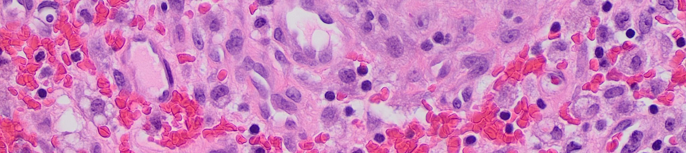
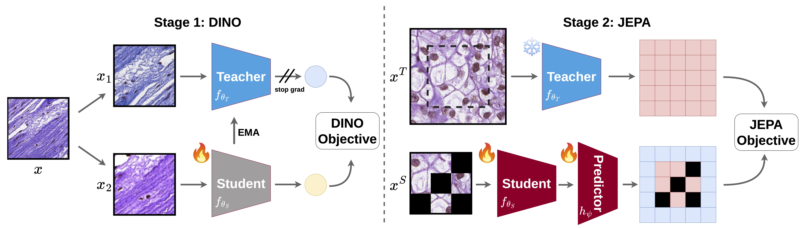

# GenBio-PathFM: A State-of-the-Art Foundation Model for Histopathology



GenBio-PathFM is a histopathology foundation model (FM) from [GenBio AI](https://genbio.ai/). 

At the time of release, GenBio-PathFM is the strongest open-weight histopathology FM and the only state-of-the-art histopathology FM trained exclusively on publicly available data.

The model weights are available on [HuggingFace](https://huggingface.co/genbio-ai/genbio-pathfm). 

GenBio-PathFM is supported in the following open-source tools:
* [TRIDENT](https://github.com/mahmoodlab/TRIDENT)
* [PrePATH](https://github.com/birkhoffkiki/PrePATH)

For more details:
* [GenBio AI Blog Post](https://genbio.ai/genbio-pathfm)
* [Paper](https://www.biorxiv.org/content/10.64898/2026.03.17.712534v1)

## Abstract

Recent advancements in histopathology foundation models (FMs) have largely been driven by scaling the training data, often utilizing massive proprietary datasets. However, the long-tailed distribution of morphological features in whole-slide images (WSIs) makes simple scaling inefficient, as common morphologies dominate the learning signal. We introduce GenBio-PathFM, a 1.1B-parameter FM that achieves state-of-the-art performance on public benchmarks while using a fraction of the training data required by current leading models. The efficiency of GenBio-PathFM is underpinned by two primary innovations: an automated data curation pipeline that prioritizes morphological diversity and a novel dual-stage learning strategy which we term JEDI (**JE**PA + **DI**NO). Across the THUNDER, HEST, and PathoROB benchmarks, GenBio-PathFM demonstrates state-of-the-art accuracy and robustness. GenBio-PathFM is the strongest open-weight model to date and the only state-of-the-art model trained exclusively on public data.



## Inference

### Option 1: HuggingFace AutoModel (recommended)
 
The simplest way to use GenBio-PathFM is via HuggingFace `AutoModel` (tested on `transformers==4.57.1`):
 
```python
from transformers import AutoModel
from torchvision import transforms
import torch
from PIL import Image
 
# Load model
model = AutoModel.from_pretrained("genbio-ai/genbio-pathfm", trust_remote_code=True)
model.eval()
 
# Transform
transform = transforms.Compose([
    transforms.Resize((224, 224)),
    transforms.ToTensor(),
    transforms.Normalize(
        mean=(0.697, 0.575, 0.728),
        std=(0.188, 0.240, 0.187),
    ),
])
 
# Inference
image = Image.open("path/to/image.png").convert("RGB")
x = transform(image).unsqueeze(0)  # [1, 3, 224, 224]
 
with torch.no_grad():
    cls_features = model(x)  # [1, 4608]
    # Or with patch tokens:
    cls_features, patch_features = model.forward_with_patches(x)  # [1, 4608], [1, 196, 4608]
```

### Option 2: Using the pip package

```bash
pip install git+https://github.com/genbio-ai/genbio-pathfm.git
```

```python
from genbio_pathfm.model import GenBio_PathFM_Inference as build_model
from huggingface_hub import hf_hub_download
from torchvision import transforms
import torch
from PIL import Image
 
weights_path = hf_hub_download(
    repo_id="genbio-ai/genbio-pathfm",
    filename="model.pth",
)
 
# Load model
model = build_model(weights_path, device="cpu")
model.eval()
 
# Transform
transform = transforms.Compose([
    transforms.Resize((224, 224)),
    transforms.ToTensor(),
    transforms.Normalize(
        mean=(0.697, 0.575, 0.728),
        std=(0.188, 0.240, 0.187),
    ),
])
 
# Inference
image = Image.open("path/to/image.png").convert("RGB")
x = transform(image).unsqueeze(0)  # [1, 3, 224, 224]
 
with torch.no_grad():
    cls_features = model(x)  # [1, 4608]
    # Or with patch tokens:
    cls_features, patch_features = model.forward_with_patches(x)  # [1, 4608], [1, 196, 4608]
```

## License

GenBio-PathFM is available under the [GenBio AI Community License](LICENSE.txt).

## Reference

If you find our work useful, consider citing our paper:

```
@article{kapse2026genbiopathfm,
  title={GenBio-PathFM: A State-of-the-Art Foundation Model for Histopathology},
  author={Kapse, Saarthak and Aygün, Mehmet and Cole, Elijah and Lundberg, Emma and Song, Le and Xing, Eric P.},
  journal={bioRxiv},
  year={2026}
}
```
